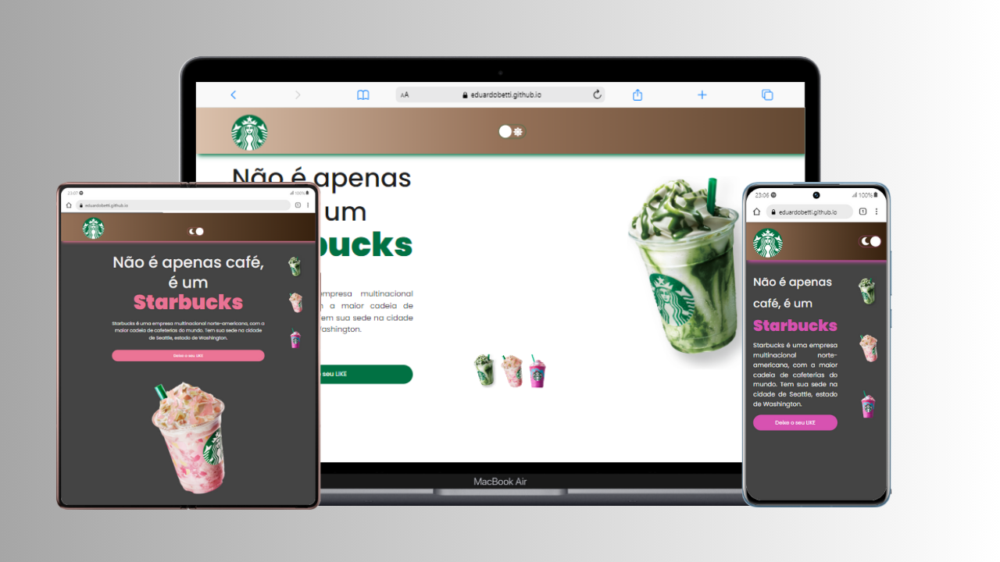

<h1>:coffee: Starbucks :coffee:</h1>
 

 

Releitura do projeto Starbucks, que foi apresentado no evento Programação do Zero em janeiro de 2024, pelo professor Rodolfo Mori.

Este projeto é o terceiro e último que estou subindo para o Github, como resolução do desafio proposto no módulo Git & Github da Trilha Full Stack PRO do Dev Club.

Trabalhar neste projeto novamente, apresentando uma releitura do mesmo, aplicando conceitos de HTML, CSS e JavaScript que aprendi neste um mês e meio de curso, foi muito gratificante.

Pude constatar minha evolução desde aquele primeiro dia de aula, em que conheci um pouco da didática do professor Rodolfo, até hoje e me sinto preparado para encarar os novos desafios 
que estão por vir tanto no curso, quanto na vida profissional.

Espero que apreciem meu projeto.

<h3>Tecnologias utilizadas:</h3>

- 

- 

- 

<h5>Curiosidades:</h5>

Este foi o primeiro projeto em que apliquei o "dark-mode", que permite ao usuário alterar a coloração de alguns elementos da tela, principalmente a cor de fundo, para que a visualização se torne mais agradável aos olhos

